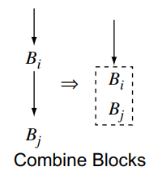

# 进阶优化提交报告

## 优化1

### 常量传播

常量传播优化目的是提高程序的执行效率。它通过在编译时将常量表达式的值直接嵌入程序代码中，来避免在运行时进行计算。

例如，假设有以下代码：

`int x = 2; int y = 3; int z = x * y;`

在这个代码中，`z` 的值为 `6`。如果编译器进行了常量传播优化，那么实际上编译器会生成如下代码：

`int x = 2; int y = 3; int z = 6;`

这样，在运行时就不需要计算 `x * y` 的值了，可以直接使用已经计算好的值 `6`。这就是常量传播优化的目的。

常量传播优化的另一个优势是可以简化程序代码，使得代码更易于阅读和理解。

不过，常量传播一般都会产生一些死代码。

####  设计思路

```
for each operation i:  
	if i defines var and expr is constant:  
		value = Compute(expr);  
		replace(var, value)
```

常量传播的设计思路相当简单，对每个指令i，如果其对一个变量进行定值，并且其表达式的值为常量，则将对其进行定值的这个变量的所有使用的地方都转换为这个常量表达式的值。

这是因为SSA为静态单赋值形式，对一个变量进行定值后不会更改其定值，因此可以如此操作。

#### 结构考虑

编写一些接受运算符和左右操作数作为参数，返回运算结果的函数。

在execute函数中，遍历每个function的每个基本块，对其中左右操作数都为常量的表达式调用上述函数，得到运算结果，并调用replace_all_use_with方法，对定值的变量后续的使用处进行替换。

本优化Pass较为简单，结构也较为清晰。

#### 关键点分析

常量传播的思路较为简单，实现的关键点主要在于判断左右操作数是否为常量时，需要使用dynamic_cast试图将其转换为常量，根据其返回值是否为nullptr即可判断其是否为常量。

之后就是replace_all_use_with方法的使用。

总而言之，本Pass只要熟悉了框架API的使用，实现起来较为简单。

## 优化2

### 死代码消除

死代码删除是指在编译时删除程序中那些永远不会被执行到的代码。编译器进行死代码删除的目的是提高程序的执行效率和减少程序体积。

一般会有：删除无用代码（比如上面的`int x = 2; int y = 3;`)；删除无用控制流（无用块、不可达块），例如，假设有以下代码：

```
void foo() {     
	std::cout << "This code will never be executed" << std::endl; 
}  
int main() {     
	std::cout << "Hello, world!" << std::endl;     
	return 0; 
}
```

在这个代码中，`foo` 函数永远不会被调用，因此它的代码也永远不会被执行。如果编译器进行了死代码删除，那么实际上编译器会生成如下代码：

```
int main() {     
	std::cout << "Hello, world!" << std::endl;     
	return 0; 
}
```

这样，在运行时就不需要加载和执行 `foo` 函数的代码了，可以节省执行时间和内存空间。

此外，死代码删除也可以使程序代码更简洁，代码更易于阅读和理解。

#### 设计思路

设计思路和伪代码参照Engineering a Compiler一书。

#### > step1 : 实现mark()

**函数功能**：找出并标记无用的操作集合

```
Mark( )
	WorkList ← Ø
	for each operation i
		clear i's mark
		if i is critical then
			mark i
			WorkList ← WorkList ∪ {i}
	while (WorkList ≠ Ø)
		remove i from WorkList
			(assume i is x ← y op z)
		if def(y) is not marked then
			mark def(y)
			WorkList ← WorkList ∪ {def(y)}
		if def(z) is not marked then
			mark def(z)
			WorkList ← WorkList ∪ {def(z)}
		for each block b ∈ RDF(block(i))
			let j be the branch that ends b
			if j is unmarked then
				mark j
				WorkList ← WorkList ∪ {j}
```

#### > step2 : 实现Sweep()

**函数功能**：去除无用的操作集合

```
Sweep( )
	for each operation i
		if i is unmarked then
			if i is a branch then
				rewrite i with a jump to i's nearest marked postdominator
		if i is not a jump then
			delete i
```

#### > step3 : 实现Clean()

**函数功能**：清除无用控制流，简化CFG

```
Clean( )
	while the CFG keeps changing
		compute postorder
		OnePass( )
OnePass( )
	for each block i, in postorder
		if i ends in a conditional branch then
			if both targets are identical then
				replace the branch with a jump  //case 1
		if i ends in a jump to j then
			if i  is empty then
				replace transfers to i with transfers to j //case 2
			if j has only one predecessor then 
				combine i and j  //case 3
			if j is empty and ends in a conditional branch then overwrite i's jump with a copy of j's branch  //case 4
```

**case1:**

**case2:**

**case3:**

**case4:**


#### 结构考虑

代码结构大致可以参照上述设计思路，首先调用mark函数，对整个程序进行一次遍历，标记not critical的指令。

再调用sweep函数，遍历程序，删除其中not critical的指令。

之后调用Clean函数，对整个程序的CFG图进行多次计算，每次调用OnePass进行处理，直到CFG图不再变化为止。

OnePass函数每次对各种case进行判断，优化无用控制流。


#### 关键点分析

关键点主要有以下几点：

* 考虑到SSA中phi函数的存在，经过分析（以及试错），上述case中的case1和case2可能不再适用，涉及到块间的信息传递，因此后来修改为优化case3以及case4
* 在处理无用控制流消除时，需要对前驱后继块以及本块之间的前驱后继关系进行处理
* 在sweep函数中，寻找对应伪代码中最近的post dominator，需要使用bfs进行搜索，使用visited记录搜索做记忆化搜索。
* 在优化时，有关phi指令的地方需要做特殊处理，因为phi指令本身涉及到控制流，如果不考虑则可能会产生一些错误。


# 优化前后的性能评测分析

我们优化目的主要是帮助程序在运行时节省执行时间和内存空间，于是我们用于性能评测分析的有两个指标：

1. 代码行数变化
2. 寄存器使用量变化

我们在评测脚本中对每一个样例计算其开优化前后的代码行数的减少量以及寄存器（变量的空间）的减少量，并在评测脚本的输出中将其打印出来。

其大致如下：


Code Line Reduction表示开优化之后代码行数相对之前减少的量，一定程度上代表程序的时间效率的优化。

Var Space Reduction表示开优化之后，使用到的变量的个数的减少量，一定程度上代表了程序空间效率的优化。

## 新增源代码文件说明

src/optimize/ConstPropagation.cpp: 常量传播Pass的代码

src/optimize/DeadCodeEli.cpp: 死代码消除Pass的代码

include/optimize/ConstPropagation.h: 常量传播Pass的头文件

include/optimize/DeadCodeEli.h: 死代码消除Pass的头文件

## 评测脚本使用方式

直接运行eval.sh

其中会打印结果的对错和Code Line Reduction以及Var Space Reduction。后二者表示了程序的时间和空间上的优化。

## 参考文献

1. [常量折叠 - 维基百科，自由的百科全书 (wikipedia.org)](https://zh.wikipedia.org/zh-sg/%E5%B8%B8%E6%95%B8%E6%8A%98%E7%96%8A)
2. [死码删除 - 维基百科，自由的百科全书 (wikipedia.org)](https://zh.wikipedia.org/zh-my/%E6%AD%BB%E7%A2%BC%E5%88%AA%E9%99%A4)
3. Keith Cooper_ Linda Torczon - Engineering a compiler-Morgan Kaufmann (2012)